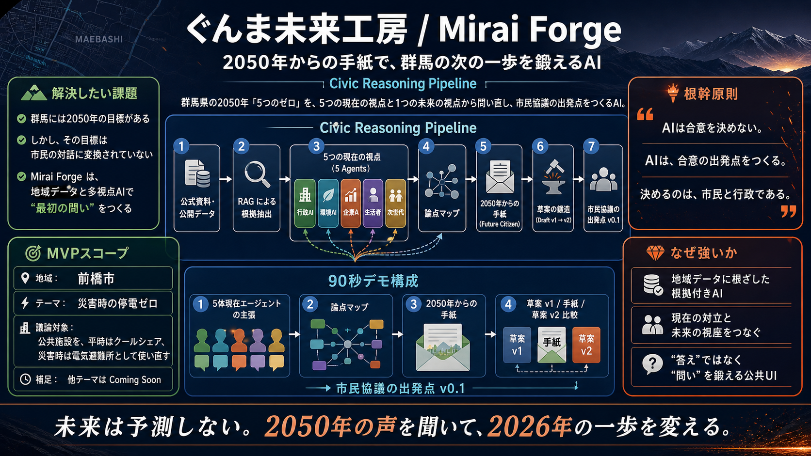

# ぐんま未来工房 / Mirai Forge


> **2050年からの手紙で、群馬の次の一歩を鍛えるAI**

Mirai Forgeは、群馬県の2050年「5つのゼロ」を、公式資料・公開データ・複数の利害視点・未来世代の視座から問い直し、**市民協議の出発点**をつくる Civic Reasoning Pipeline です。

AIが政策の答えを決めるのではありません。  
AIが、根拠と仮説を分けながら、対話を始めるための「最初の問い」を鍛えます。

---

## 審査員の方へ

Mirai Forgeで見てほしいのは、AIがきれいな文章を生成することではありません。

見てほしいのは、**公式資料と複数視点からつくった草案が、2050年の仮想市民の手紙によって、より市民協議に耐える問いへ変わる瞬間**です。

| 観点 | Mirai Forgeの答え |
|---|---|
| 課題 | 群馬の2050年目標が、市民の生活実感に接続された議論になりにくい |
| 提案 | 公式資料・公開データ・5視点・未来視点を組み合わせ、協議の出発点をつくる |
| AIの必然性 | 多視点の並列整理、根拠と仮説の分離、未来視点による問い直しを短時間で行う |
| 独自性 | 2050年からの手紙が、演出ではなく草案 v2 を変える入力として機能する |
| 公共性 | AIは合意を決めず、最終判断を市民と行政に戻す |
| デモの見どころ | 「効率最大化」から「取り残される人を起点にした設計」へ草案が変わる3カラム比較 |

---

## なぜつくるのか

群馬には、2050年に向けた「5つのゼロ」という明確な未来目標があります。

しかし、その目標はまだ、市民一人ひとりが自分の生活として議論できる問いに十分変換されていません。

たとえば「災害時の停電ゼロ」は、電力設備だけの話ではありません。猛暑の日にどこへ避難できるのか。高齢者が歩いて行ける場所はあるのか。通信は生きているのか。薬局、商店、寺院、公共施設はどう連携するのか。誰が鍵を持ち、誰が運営し、誰が取り残されるのか。

Mirai Forgeは、こうした複雑な論点を、AIによって「結論」ではなく「協議可能な問い」へ変換します。

---

## 一言でいうと

> **未来は予測しない。  
> 2050年の声を聞いて、2026年の一歩を変える。**

Mirai Forgeは、会話AIや行政チャットボットではありません。

公式資料と公開データをもとに、5つの現在の視点が論点を分解し、2050年の仮想市民から届く手紙が草案を問い直します。最後に出力されるのは、合意案ではなく、次に市民へ聞くべき「協議の出発点」です。

---

## Demo Theme

| 項目 | 内容 |
|---|---|
| 地域 | 前橋市 |
| テーマ | 災害時の停電ゼロ |
| 議論対象 | 公共施設を、平時はクールシェア、災害時は電気避難所として使い直す |
| 未来視点 | 2050年の前橋市民からの手紙 |
| 最終出力 | 市民協議の出発点 v0.1 |

MVPでは1テーマに集中します。対象を絞ることで、単なるアイデア紹介ではなく、90秒で「問いが鍛え直される」瞬間を見せるデモにしています。

---

## 体験の流れ



```text
公式資料 + 公開データ
        ↓
RAGによる根拠抽出
        ↓
5つの現在の視点による並列推論
        ↓
論点マップ
        ↓
2050年の仮想市民からの手紙
        ↓
草案 v1 → 草案 v2 への鍛造
        ↓
市民協議の出発点 v0.1
```

デモ画面では、以下のシーンを1ページの Civic Theater UI として再生します。

1. 問いを置く
2. 入力データを示す
3. 5つの現在の声を並べる
4. 論点マップに整理する
5. 2050年からの手紙を受け取る
6. 手紙の前後で草案がどう変わったかを比較する
7. 市民協議の出発点として終える

---

## 5つの現在の視点

Mirai Forgeでは、ひとつの政策テーマを単一のAIに答えさせません。立場の異なる5つの視点を並列に走らせ、根拠・仮説・懸念を分けて表示します。

| 視点 | 役割 | 何を重視するか |
|---|---|---|
| 行政AI | 制度・予算・防災計画 | 既存計画との整合性、実装可能性 |
| 環境AI | 再エネ・脱炭素・レジリエンス | 5つのゼロとの整合、脱炭素効果 |
| 企業AI | BCP・採算・地域運営 | 費用対効果、持続可能な運営 |
| 生活者AI | 高齢者・徒歩圏・避難弱者 | 当事者のアクセス、取り残される人 |
| 次世代AI | 2050年の参加者・長期視点 | 将来世代が直せる余白 |

この設計により、「AIがもっともらしい答えをひとつ返す」状態を避けます。複数の観点を衝突させ、市民が議論すべき論点を見える形にします。

---

## 2050年からの手紙

Mirai Forgeの特徴は、未来を「予測値」として扱わないことです。

2050年の仮想市民からの手紙は、未来を断定するためではなく、現在の議論で見落としうる視点を浮かび上がらせるためのシナリオです。

たとえば、手紙はこう問いかけます。

> 誰が、最後まで取り残されるのか？

この問いによって、草案は次のように変わります。

| 手紙の前 | 2050年の手紙 | 手紙の後 |
|---|---|---|
| 効率を最大化する公共施設の再編 | 取り残される人は、どこで決まるのか？ | 徒歩圏・記憶される場所・選べる避難を含む施設ネットワーク |
| 26館の効率配置 | 1.2km離れた地区で亡くなった一人暮らしの方 | 民間拠点を含む分散ネットワーク |
| 蓄電池 + 太陽光 | 毎朝顔を合わせていた商店 | 徒歩圏最低1拠点 |

ここがMirai Forgeのクライマックスです。手紙は演出ではありません。手紙によって、草案 v2 の論点が実際に変わります。

---

## 最終的に出すもの

Mirai Forgeは、政策の決定案ではなく、次の市民協議へ持ち込むためのたたき台を出力します。

```text
市民協議の出発点 v0.1

1. 今日の問い
2. 共有できそうな方向
3. まだ議論すべき論点
4. 2050年の手紙で変わった点
5. 根拠
6. 仮説
7. 次に市民へ聞くべき質問
8. 90日アクション
```

出力例:

- あなたの地域で、災害時に最後まで開いていてほしい場所はどこですか？
- 災害のときに名前を呼んでもらえる場所が、近くにありますか？
- 公共施設だけでなく、薬局・小規模商店・寺院・診療所を電気避難所ネットワークに含められるか？

---

## 審査で見てほしいポイント

### 1. AIが「答え」ではなく「問い」をつくる

Mirai Forgeは、AIに政策決定を委ねません。AIの役割は、根拠を整理し、複数視点を並べ、協議の出発点をつくることです。

### 2. 未来視点が出力を変える

2050年からの手紙は、感動演出ではなく、草案 v1 を草案 v2 に変える入力です。3カラム比較によって、何が変わったかを可視化します。

### 3. 地域文脈に根ざしている

群馬県5つのゼロ宣言、前橋市の公共施設、災害時の停電、徒歩圏、民間生活拠点など、地域の具体的な論点に落とし込んでいます。

### 4. 根拠と仮説を分ける

公式資料・オープンデータに基づく主張と、未検証の仮説をUI上で分離します。AI出力をそのまま正解として扱わない設計です。

### 5. 市民参加へ接続する

最後に出るのは「最適解」ではなく、「次に市民へ聞くべき質問」と「90日アクション」です。デモの終点が、実際の協議の始点になります。

---

## Safety Principles

Mirai Forgeは、公共領域でAIを使うために、以下の原則を守ります。

| 原則 | 内容 |
|---|---|
| AIは合意を決めない | 出力は合意案ではなく、協議の出発点 |
| Future Citizenは決定権を持たない | 2050年の手紙は仮想シナリオとして明記 |
| 根拠と仮説を分ける | citation不能な主張は仮説ラベルで扱う |
| 対立を捏造しない | 対立が見つからない場合は正直に表示する |
| 構造化出力を使う | LLM出力はJSON Schemaを通してUIへ渡す設計 |
| 本番デモはcached mode | API障害に左右されない安定した審査体験を優先 |

根幹原則:

```text
AIは合意を決めない。
AIは、合意の出発点をつくる。
決めるのは、市民と行政である。
```

---

## Current Prototype

このリポジトリには、審査・ピッチ用の静的プロトタイプが含まれています。

| パス | 内容 |
|---|---|
| `mockup/Mirai Forge.html` | 1ページ完結のデモ画面 |
| `mockup/app.jsx` | シーン進行、テンポ、語り手切り替え |
| `mockup/data/seed.js` | cached demo seed。5視点、手紙、草案 v1/v2 |
| `mockup/components/` | シーン、カード、クロームUI |
| `mockup/styles/forge.css` | Civic Theater UI のスタイル |
| `docs/mirai_forge_requirements_v1_3_1_full.md` | 要件定義・デモシナリオ (v1.3.1 凍結版) |
| `docs/MiraiForge.png` | プロダクト概要図 |
| `assets/mirai-forge-hero.png` | README用ヒーロー画像 |

---

## How to Run

このプロトタイプは、ローカルでHTMLを開くだけで確認できます。

```text
mockup/Mirai Forge.html
```

ブラウザで開くと、Mirai Forgeのシネマ型デモが表示されます。

操作:

- 右矢印キー / Space: 次のシーンへ
- 左矢印キー: 前のシーンへ
- Home: 最初に戻る
- 右側パネル: 鍛冶場の熱量、2050年の語り手、テンポを切り替え

注意: 現在のプロトタイプはReact/BabelをCDNから読み込む静的デモです。オフライン環境では依存スクリプトをローカル化する必要があります。

---

## Planned Architecture

将来的な実装では、以下の構成を想定しています。

| レイヤー | 技術 |
|---|---|
| Frontend | Next.js / TypeScript / Tailwind CSS / Framer Motion |
| Backend | FastAPI / Python |
| AI Orchestration | OpenAI Agents SDK |
| Models | GPT-4o-mini for 5 agents, GPT-4o for synthesis and future citizen |
| RAG | text-embedding-3-small + official/open data sources |
| Type Safety | Pydantic → JSON Schema → TypeScript types |
| Demo Reliability | cached / live / video modes |

本番デモでは、ライブ生成よりも「確実に伝わる体験」を優先し、cached JSONを既定にします。Q&Aや拡張デモではlive modeを使う想定です。

---

## Why Civic Reasoning Pipeline?

市民参加の現場で必要なのは、もっともらしい単一回答ではありません。

必要なのは、論点を分けること、根拠を示すこと、見落とされた当事者を想像すること、そして次の対話へ進めることです。

Mirai Forgeは、RAG、マルチエージェント、未来シナリオ生成を、公共性のある流れに束ねます。

```text
調べるAI
  ↓
考えるAI
  ↓
問い直すAI
  ↓
市民へ手渡すAI
```

この一連の流れを、Civic Reasoning Pipeline と呼んでいます。

---

## Closing

Mirai Forgeがつくるのは、政策の答えではありません。

市民が未来を創るための、最初の問いです。

> **未来は予測しない。  
> 2050年の声を聞いて、2026年の一歩を変える。**
